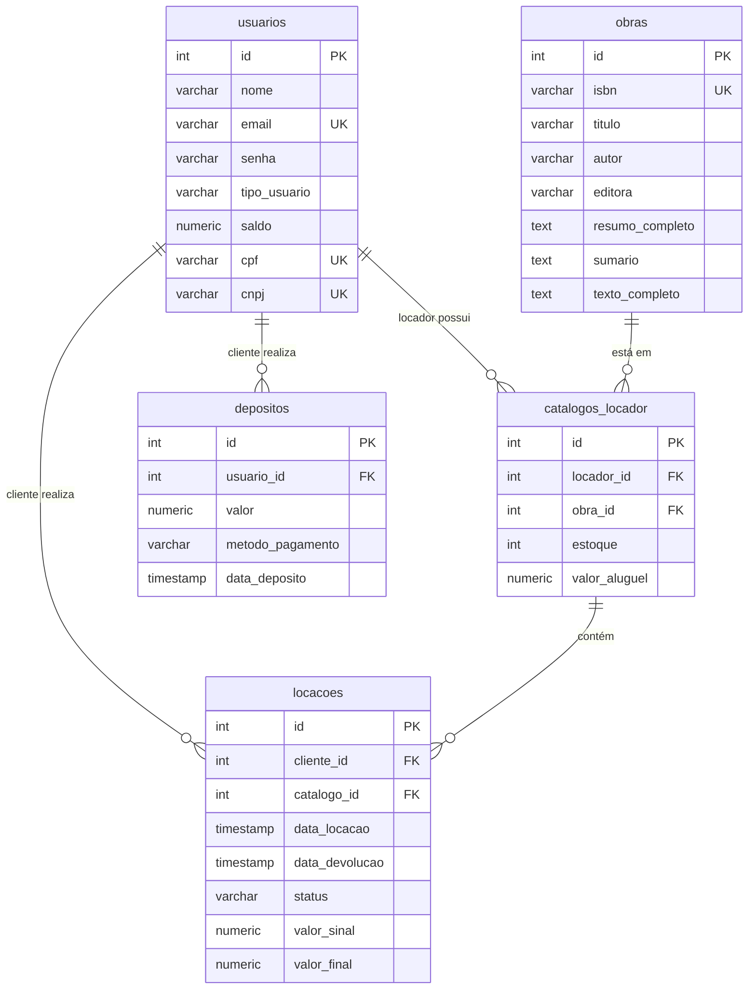

# LibWay (Desafio Dunnas)

<p align="justify">
LibWay é um Sistema de Gerenciamento de Aluguel de Livros que foi desenvolvido como solução para o desafio de desenvolvimento Full Stack Java proposto pela Dunnas. O sistema permite que clientes e locadores se registrem, e tenham acesso ao sistema baseado em seus perfis. Clientes podem navegar pela vitrine de obras disponíveis para aluguel, enquanto locadores podem adicionar obras do catálogo geral em seu estoque.
</p>
<p align="justify">
A solução adota uma arquitetura em camadas com o padrão MVC, operando sobre o Spring Boot. A principal decisão de design foi alocar a lógica de negócio crítica, como as transações de aluguel e devolução, na camada de banco de dados, utilizando funções em PostgreSQL.
</p>

---

## Sumário
1. [Principais funcionalidades](#principais-funcionalidades)
2. [Decisões de arquitetura e Tecnologias](#decisões-de-arquitetura-e-tecnologias)
3. [Distribuição da lógica (Banco vs. Aplicação)](#distribuição-da-lógica-banco-vs-aplicação)
4. [Diagrama relacional do banco de dados](#diagrama-relacional-do-banco-de-dados)
5. [Instruções de setup e execução](#instruções-de-setup-e-execução)
6. [Processo de desenvolvimento](#processo-de-desenvolvimento)

---

## Principais funcionalidades

### Perfis de usuário (Cliente e Locador)
* **Cadastro e Autenticação:** Sistema de registro e login seguro com criptografia de senhas (BCrypt).
* **Controle de Acesso por Papel:** O Spring Security é utilizado para garantir que Clientes e Locadores tenham acesso apenas às suas respectivas funcionalidades.

### Módulo do locador
* **Painel Principal:** Visualização do faturamento e do seu catálogo pessoal de livros, com informações de estoque e preço de aluguel.
* **Gerenciamento de Obras:** Possibilidade de cadastrar uma nova obra no catálogo global do sistema através de um formulário em um modal.
* **Gerenciamento de Catálogo:** Funcionalidade para visualizar o catálogo global e adicionar obras existentes ao seu catálogo pessoal, definindo estoque e preço de aluguel.
* **Histórico de Locações:** Funcionalidade para visualizar locações ativas e finalizas, contendo informções do nome do livro, datas e valores.

### Módulo do cliente
* **Painel Principal:** Visualização do saldo em conta e do histórico de aluguéis ativos e finalizados.
* **Gestão de Saldo:** Funcionalidade para adicionar saldo à conta e uma página contendo o histórico dos depósitos.
* **Vitrine de Livros:** Uma página dedicada onde o cliente pode visualizar todos os livros de todos os locadores que estão disponíveis para aluguel.

### Sistema de locação e devolução
* **Aluguel com Sinal:** Ao alugar um livro, o cliente paga um sinal de 50% do valor do aluguel, que é debitado do seu saldo e creditado no saldo do locador. O estoque é decrementado.
* **Acesso a Informações:** Após o aluguel, o cliente passa a ter acesso às informações completas da obra (Sumário e texto).
* **Devolução e Pagamento Final:** Funcionalidade para o cliente devolver o livro, pagando os 50% restantes e restituindo o estoque do locador.

---

## Decisões de arquitetura e tecnologias
<p align="justify">
A stack tecnológica foi escolhida para atender aos requisitos do desafio, adicionalmente a eles existe o Docker, uma tecnologia opcional escolhida para melhorar o setup do banco de dados.
</p>

* **Java 17 e Spring Boot 3.5.5** (Backend)
* **JSP com JSTL e Bootstrap 5** (Frontend)
* **PostgreSQL 10 com Flyway** (Banco de Dados)
* **Docker & Docker Compose** (Containerização do Banco de Dados)
* **Maven** (Gerenciamento de Dependências)

---

## Distribuição da lógica (Banco vs. Aplicação)
<p align="justify">
Para atender ao requisito de que pelo menos 50% da lógica de negócio residisse no banco, foi feita uma divisão de responsabilidades:
</p>

#### 🏦 No banco de dados (PostgreSQL - PL/pgSQL)
<p align="justify">
O banco foi encarregado das operações críticas, transacionais e que garantem a integridade dos dados.
</p>

* **Função `adicionar_saldo_usuario (V06)`:** Responsável por adicionar saldo a um usuário e registrar a transação na tabela de depósitos. Contém validações para garantir que o valor seja positivo e que o usuário exista.
* **Função `realizar_locacao (V07)`:** É a proposta principal do sistema. Esta função é responsável por efetuar a locação de uma obra, que representa o pagamento de 50% do valor do aluguel e liberação de conteúdos protegidos da obra para o cliente que alugou.
* **Função `realizar_devolucao (V09)`:** Lógica para o processo de devolução da obra, que inclui o pagamento dos 50% restantes do valor do aluguel, a restituição do estoque do locador.

#### 💻 Na aplicação (Java/Spring)
<p align="justify">
A aplicação ficou responsável pela coordenação, segurança, apresentação e validação de entrada.
</p>

* **Gerenciamento de Acesso:** O Spring Security controla a autenticação e autorização, definindo quais URLs cada papel (CLIENTE, LOCADOR) pode acessar.
* **Renderização de Views:** O padrão MVC é usado para separar a lógica de apresentação (JSP) da lógica de controle (Controllers).
* **Orquestração:** Os Services em Java não contêm a lógica transacional crítica, mas são responsáveis por:
    * Chamar as funções do banco de dados através dos Repositories.
    * Preparar os dados para serem exibidos nas views.
    * Tratar exceções e fornecer alguns feedbacks ao usuário.
* **Validação de Formulários:** Validações de entrada, como verificar se um email já existe antes de tentar o registro, são feitas na camada de serviço para proporcionar uma melhor experiência ao usuário.

---

## Diagrama relacional do banco de dados
<p align="justify">
Abaixo está o diagrama Entidade-Relacionamento que representa a estrutura do banco de dados do LibWay.
</p>


## Instruções de setup e execução
<p align="justify">
Siga os passos abaixo para configurar e executar o projeto localmente.
</p>

**Pré-requisitos:**
* Git
* Java 17 ou superior
* Apache Maven
* Docker e Docker Compose (Opcional, mas recomendado)

**Passos:**

1.  **Clonar o Repositório**
    ```bash
    git clone https://github.com/BrennoKM/LibWay
    cd LibWay
    ```

2.  **Configurar Variáveis de Ambiente (somente caso use o docker compose para subir o banco)**
    <p align="justify">
    Crie uma cópia do arquivo de exemplo `.env.example` e renomeie para `.env`.
    </p>
    
    ```bash
    cp .env.example .env
    ```
    <p align="justify">
    Abra o arquivo `.env` e, se desejar, altere as credenciais padrão do banco de dados e do pgAdmin.
    </p>

3.  **Subir o Ambiente Docker (ou configurar manualmente o banco)**
    <p align="justify">
    Este comando irá iniciar os containers do PostgreSQL e do pgAdmin em segundo plano.
    </p>
    
    ```bash
    ## Certifique de ter a versão v2 do docker compose, ou tente usar "docker-compose" caso sua versão seja a v1.
    docker compose up -d
    ```

4.  **Executar a Aplicação Spring Boot**
    <p align="justify">
    Use o Maven Wrapper para compilar e iniciar a aplicação.
    </p>
    
    ```bash
    ./mvnw spring-boot:run
    ```

5.  **Acessar a Aplicação**
    * **Aplicação LibWay:** `http://localhost:8080`
    * **pgAdmin (para gerir o banco):** `http://localhost:89` (use o email e a senha do seu arquivo `.env`)


6.  **Credenciais de Teste**
    <p align="justify">
    Para testar, acesse o formulário de registro e crie um usuário do tipo CLIENTE e outro do tipo LOCADOR para testar a aplicação.
    </p>

---

## Processo de desenvolvimento
<p align="justify">
O desenvolvimento foi realizado de forma incremental e iterativa e o processo pode ser resumido nas seguintes macro-etapas:
</p>

* **Fundação e Ambiente:** Configuração inicial do projeto, ambiente Docker, conexão com o banco e estrutura de migrações com Flyway.
* **Módulo de Autenticação:** Construção da base de usuários, incluindo a entidade, repositório, serviço com criptografia de senha e a configuração completa do Spring Security com controle de acesso por papel.
* **Interface de Acesso:** Criação das páginas de login, registro e da navegação entre páginas.
* **Módulo do Locador:** Implementação do fluxo completo para o locador, desde o cadastro de obras globais até a adição dessas obras ao seu catálogo pessoal com estoque e preço e acompanhamento de locações ativas/finalizadas.
* **Módulo do Cliente:** Criação do painel do cliente, com visualização de saldo, histórico de aluguéis e a vitrine de obras disponíveis.
* **Lógica no Banco:** Implementação das FUNCTIONS em PostgreSQL para as operações críticas de `adicionar_saldo`, `realizar_locacao` e `realizar_devolucao`, garantindo a integridade dos dados.
* **Refatoração e Correções:** Alguns ajustes como tratamento de erros e melhorias no reaproveitamento de código.

## Principais melhorias futuras
<p align="justify">
O projeto contém diversas oportunidades de melhorias e novas funcionalidades que podem ser implementadas, tais como:
</p>

* **Filtros de Busca:** Adicionar filtros de pesquisa personalizados em diferentes partes do projeto (Ex: Vitrine de Livros, Catálogo do Locador, Históricos de Locações e Depósitos).
* **Uso de DTOs:** Implementar Data Transfer Objects (DTOs) para melhorar a comunicação entre camadas e aumentar a segurança dos dados sensíveis.
* **Melhorias na UI/UX:** Refinar a interface do usuário para uma experiência mais intuitiva e responsiva.